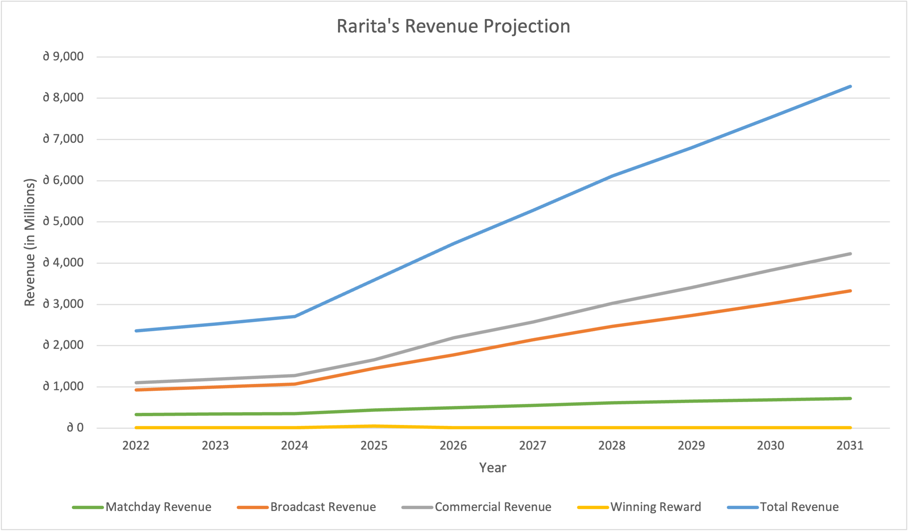
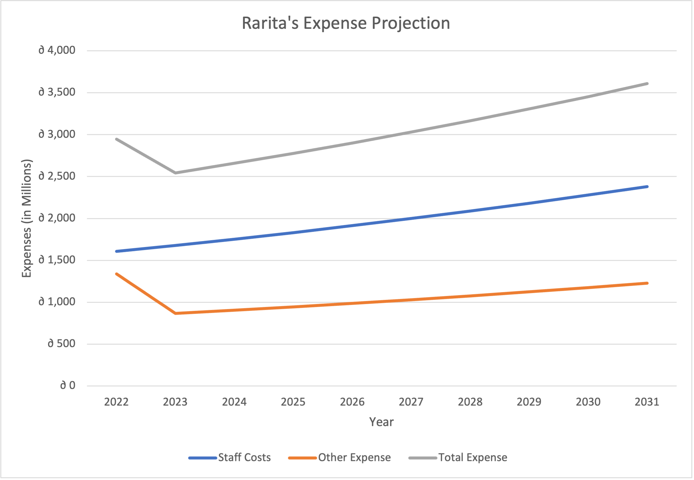
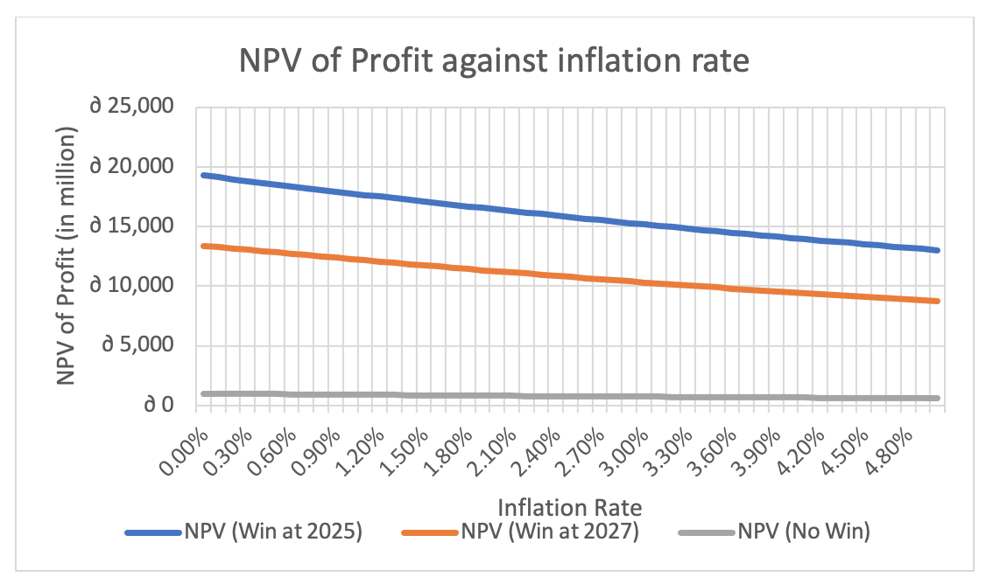

### Author: 
>
* Jia Xuan Muk
* Erica Soenarjo
* Viana Francisca Dewi
* Hiu Ming Yip
* Yolanda Li

## Table of Contents
<!-- TABLE OF CONTENTS -->

  
Table of Contents

  <ol>
    <li>
      <a href="#executive-summary">Executive Summary</a>
    </li>
    <li>
      <a href="#objectives">Objectives</a>
    </li>
    <li>
      <a href="#team-selection">Team Selection</a>
      <ol>
        <li><a href="#basic-formation">Basic Formation</a></li>
        <li><a href="#player-selection">Player Selection</a></li>
        <li><a href="#alternative-formations">Alternative Formations</a></li>
        <li><a href="#other-considerations">Other Considerations</a></li>
      </ol>
    </li>
    <li>
      <a href="#economic-impact">Economic Impact</a>
      <ol>
        <li><a href="#revenue-projection">Revenue Projection</a></li>
        <li><a href="#expense-projection">Expense Projection</a></li>
        <li><a href="#net-profit-projection">Net Profit Projection</a></li>
         <li><a href="#gdp-projection">GDP Projection</a></li>
         <li><a href="#macroeconomics">Macroeconomics</a></li>
      </ol>
    </li>
    <li>
      <a href="#implementation-plan">Implementation Plan</a>
    </li>
    <li>
      <a href="#assumptions">Assumptions</a>
      <ol>
        <li><a href="#key-assumptions">Key Assumptions</a></li>
        <li><a href="#quantitative-assumptions">Quantitative Assumptions</a></li>
       </ol>
    </li>      
  <li>
      <a href="#risk-and-risk-mitigation-strategies">Risk and Risk Mitigation Strategies</a>
    </li>
  <li>
      <a href="#Data-Limitations-Data-Sources-and-Sensitivity-Analysis">Data Limitations, Data Sources, and Sensitivity Analysis</a>
    <ol>
        <li><a href="#Data-Limitations">Data Limitations</a></li>
        <li><a href="#Data-Sources">Data Sources</a></li>
        <li><a href="#Sensitivity-Analysis">Sensitivity Analysis</a></li>
       </ol>
   </li>
   <li>
      <a href="#references">References</a>
    </li>
     <li>
      <a href="#Appendices-Methodologies-and-R-Code">Appendices, Methodologies and R-Code</a>
       <ol>
        <li><a href="#Appendix-A-Quantified-Measure-of-A-competitive-Team">Appendix A:Quantified Measure of A competitive Team</a></li>
        <li><a href="#Data-Sources">Data Sources</a></li>
        <li><a href="#Sensitivity-Analysis">Sensitivity Analysis</a></li>
       </ol>
    </li>
  </ol>

Appendix A:Quantified Measure of A competitive Team

## Executive Summary

In light of recent trends where “competitive” sport teams have benefited one’s economy considerably, this project is jointly executed with Rarita’s Commissioner of sport, Hammessi Bayes to construct a sustainable and “competitive” national team with a goal of achieving positive economic impact for Rarita. An initial fund of 995 million Doubloons (∂) were allocated for the project with additional capital raised through various revenue streams outlined within the report. 

This project employs empirical datasets of player statistics across 55 countries within leagues and tournaments held across 2020 to 2021 provided by the Society of Actuaries (SOA) for the national team selection and Brazilian FIFA along with GDP dataset to determine correlations between competitiveness and GDP growth. 

A final team selection was constructed via rigorous modelling involving logistic regression and best subset selection in considerations of qualitative measures such as salary, teamwork, and team formation. With a GDP growth of 2.32% and a revenue growth of 5.79% prior to winning a championship, the project is anticipated to project a supplemental 1.88% and 9.21% of growth respectively after winning the championship title, boosting Rarita’s economy significantly. Further, a high net present value (NPV) of ∂ 14,496.06 million computed from the 10-year net profit associated with the national team emphasizes the profitability and sustainability of the project. 

Finally, the construction of the national team is reinforced with a 10-year implementation plan detailing main events, mitigation strategies of main risks the projects may face and key metrics to monitor team performance.   

> A detailed outline of the project undertaken can be found via: [SOA 2022 Student Research Case Study Challenge](https://www.soa.org/research/opportunities/2022-student-research-case-study-challenge/)

## Objectives

With a goal to increase Rarita’s global visibility and achieve positive economic impact, Rarita has decided to construct a competitive and sustainable football squad amongst domestic players to enter the world of International Football. The soccer team’s “competitiveness” is further quantified and elaborated in [Appendix A](https://github.com/ACTL4001-T1-2022/Group-123-Consulting/blob/39ac652c93b0cb7b91b79c840ed93b86be38f1b4/Appendix%20A). With a limited budget of 995 million Doubloons, the project’s objective is to fulfill this goal through a comprehensive team selection process, a resilient risk mitigation framework, along with a detailed implementation plan and economic projections for the next 10 years incorporating a sensitivity analysis. 

## Team Selection

### Basic Formation

4-3-3 was chosen as the main formation of the team consisting of 3 forwards, 3 midfielders, 4 defenders, and 1 goalkeeper. This provides more tactical flexibility to strike a balance between offensive and defensive strategies by adjusting the midfielders to form other connotations like 4-5-1 and 4-2-3-1. Detailed positions of each player are illustrated below.

> _The formation of proposed football team_

<h1 align="center">
 
</h1>

### Player Selection

The 11-player team is formed by analysing past performances of Rarita players in the league. The scouting methodology is based on 
>
* Construct a logistic regression model trained by tournament results of other countries in 2021 categorized by positions
* Consider the average strengths of players in the same position and returns the success probability of achieving top 10 in the tournament
* Best subset selection was used to filter the suitable factors contributing to the success of the team

> _Scouted players_

<h1 align="center">
 
</h1>

### Alternative Formations

4-3-3 allows flexibility in shifting to other formations. With two midfielders capable of switching to attacker and defender, formations can be modified to approach different situations.
> 
* _L. Mandala_ as attacking midfielder → Aggressive 4-2-3-1 formation
* _F. Yunusa_ as defensive midfielder and wingers drop back → Defensive 4-5-1 formation

### Other Considerations
Full Rarita domestic players are selected to play for the national team. There are 2 major advantages:
> 
* _Patriotism motivation_ - Players with a sense of belonging can perform better when they are playing for their country
* _Reduce cost of loaning_ - Loaning players from other nations may cost extra variable expenses to the football team. 

Majority of the players come from the same squad; hence the prevailing chemistry can enhance overall performance of team and reduce training time for team bonding.  

|     Squad     | Number of Players |
|:-------------:|:-----------------:|
|  Strong Oaks  |         4         |
| Black Coyotes |         2         |
|  Other Squads |         6         |

Also, players are evenly distributed at age, this can allow sustainability and long-term development of the club.
>
* Experience old players can lead the team when the team is at the beginning of establishment.
* Young players can stand alone after years of training and matches.

The balance between old and young players constructs a beneficial cycle for the club’s sustainable development.

<h1 align="center">
 
</h1>

## Economic Impact  
### Revenue Projection

The total revenue for Rarita is projected to increase gradually across 2022 to 2031.

The winning prize is estimated using the 2022 FIFA winning prize, the hefty sum of winning the championship will significantly affect revenue growth during the championship year. Other revenue sources will also be impacted by the championship, resulting a sharp increase in total revenue during the championship year. The revenue growth remains relatively stable for all other years.	 
Additionally, by building a world class football stadium in 2022, supplemental revenue by renting out the venue can be generated. This revenue source is included in the commercial. 

<h1 align="center">
 
</h1>

### Expense Projection

The total expense includes two main categories, staff costs and other expenses. Of which, ∂99.86 million is attributed to the salary of football players.

The total expense for Rarita is expected to be higher in 2022 due to initial costs such as the stadium construction which costs approximately ∂520 million, developing team selection model, staff hiring, building training amenities and other facilities.

<h1 align="center">
 
</h1>

### Net Profit Projection

Rarita will experience loss for the first two years due to the large allocation to the stadium construction, however, will achieve a positive net profit for the remaining years. Despite the negative net profits, the initial investment of ∂ 995 million will act as a buffer to offset those losses. 
A positive net profit NPV demonstrates the sustainability and profitability of investing in a national football team.

<h1 align="center">
 
</h1>

### GDP Projection

Rarita’s GDP is estimated by referencing the data of a real-life national football team, Brazil National Football Team, a renowned "competitive" team holding titles to 5 Federation Internationale de Football Association (FIFA) championships since 1930. Winning a championship may have been a significant attribute for GDP growth as shown in the steadily increasing trend in Brazil's GDP for almost 10 years after its last FIFA championship in 2002. 

This observation underpins Rarita’s objectives. Therefore, the GDP growth rate for Brazil was used in projecting Rarita’s expected GDP. Incorporating the population growth, the GDP per Capita for Rarita will increase steadily and ended with ∂ 32,648 in 2031.

The figure below shows that the GDP per Capita for East Rarita would be the highest among the three provinces, while West Rarita would be the lowest. This can be accounted to the population differences in the three provinces.

<h1 align="center">
 
</h1>

### Macroeconomics

#### Tourism

A competitive football match may increase tourism as illustrated in the ‘Football Tourism in the UK’ report where 1.4 billion dollars were spent by overseas visitors who attended football matches across UK in 2019. The impact of a competitive football match not only adds revenue towards the commercial, broadcasting and matchday sectors for Rarita’s National Football Team, but it also generates indirect stream of revenues in via their consumptions. 

#### Employment Rate

Along with a booming tourism industry, huge number of employment opportunities are created through hospitality and travel services. Furthermore, this direct employment effect generates even more stream of revenues through secondary workforce demand to accommodate for the additional inflow of tourists. 
Correspondingly, this project would be beneficial to Rarita's microeconomic and macroeconomic sectors. The profit generated could be used to fund other social beneficial projects in the country. Furthermore, with an increased global visibility, the multiplier effect will also boost the impact of tourism and other economic sectors in the country with increased employment rate and tax revenues. 

## Implementation Plan
Rarita’s football team’s success over the next 10 years is aided by thorough planning, ensuring that the trajectory of performance aligns with expectations. Team selection, sources of revenue and spending areas are vital in the team’s success and are investigated in the implementation plan.

The initial team selection is the most crucial step in this project. Additional training and monitoring are required before consolidating players in future matches. Backup players are also selected and trained for contingency scenarios while those undergoing training are lent out to other competing countries, generating extra revenue. As players and competitors naturally improve in skill, the team is reassessed yearly to optimise playing performance.

Spending areas include extensive and highly trained staff. This includes training coaches, administrative positions, and healthcare. As the team improves performance and partakes in additional projects, staff should also be extended to maximise the team’s capability. In a similar vein, training resources and other assets be invested in to mirror team performance. Projected spending areas also include a stadium, serving as a new stream of revenue once the initial investment is made. Becoming a global brand is a key factor to the success as a football team and impacting Rarita’s economy.

To provide for these spending areas, there are multiple revenue streams, including matchday, broadcasting and commercial revenue. Additional revenue streams are through social media marketing, collaborations, and advertising in Rarita’s stadium. 

The key steps and projects aiding in building a competitive football team are summarised in the following timeline. 
<h1 align="center">
 
</h1>

To ensure that these steps are effective, key metrics are regularly reported. These metrics address both the function of the team internally and its wider impact on Rarita.

|    Metric           | Reporting Frequency |           Impact           |
| ------------------- | ------------------  | -------------------------- |
| Rarita GDP | Annual | Monitor the influence of competitive sports team on country GDP.|
| Conversion rate | Annual | Determine state of the economy through currency movements.|
| Rank in tournament | Annual | Observe the change in position and performance of Rarita’s football team.|
| Probability of success in tournament | Annual | Ensure the sports team remains competitive among dynamic competing teams.|
| Social media following | Semi-annual | Monitor following as the popularity of the team has strong correlation with incoming revnue (commericals, broadcasting and sponsorships.|

## Assumptions
### Key Assumptions
**Football Team**
>
* Performance not deviated from the past
* Teams not changed or improved in skill
* No home or away team advantages or disadvantages
* No loaning of players between nations during 2020 and 2021 tournaments 
* Winning probabilities from tournaments are tied to all individuals in the nation’s soccer teams 

**Championship year**
>
* Assumed that a win in 2025.
* Assumed to be a “competitive” team for the other years

### Quantitative Assumptions
**GDP Projection**
>
* GDP growth is calculated by using Brazil’s 1999–2008 national football team data as a benchmark where 2002 is the championship year.
* GDP growth rate: 2.32% before championship; 4.20% after championship
* Annual population growth for East Rarita is 0.67%; Central Rarita is 0.04%; and West Rarita is 0.57%

**Inflation Rate – 3.59%**

**Expense Projection**
>
* A constant growth rate of 4% for 2023-2031
* 0.88 Euro/USD conversion rate 
* 0.009 Doubloons/Euro conversion rate. 

## Risk and Risk Mitigation Strategies

Below are the risks associated to the national football team project with their respective mitigation strategies to minimize the material, operational and reputational impact on Rarita.

| Risk Category | Risk Elaboration | Mitigation Strategy |
| ------------- | ---------------  | ------------------- |
| Data Overfitting Risk | The overdependence of player performance datasets across a limited 2 years may lead to overfitting and bias of data resulting in inaccurate reflection of current team performance. | A robust framework was established to regress significant all-rounded criteria in determining the success probabilities for the final team formation. |
| Assumption Deviation Risk | Rarita’s economic condition and competitiveness in the next 10 years may differ from model expectations and key assumptions. This may lead to deviations of Rarita’s soccer team’s financial forecasts and projected GDP growth. | Sensitivity changes of key assumptions were considered during selection process and economic forecasts to provide adequate sustainability of the national team. |
| Contingency Risk | Unforeseen events such as injured players, political divides within Rarita may adversely affect the final team performance hindering tourism, revenue, and GDP growth expectations. | Substitute players were accounted for to reduce disruptions to team’s performance. Contracts agreements with comprehensive considerations will also be drafted to minimize political and any unexpected risks. Lastly, an attentive and measurable implementation plan was developed to monitor team’s progress allowing for prompt actions to counter any contingency risks.|
| Funding Risk | Accruing from preceding risks, funding risks may arise from the lack of capital due to cash flow disruptions in the maintenance of the soccer team or higher funding costs due to undesirable tournament outcomes. | Minimal capital margin for the soccer team is set up to reduce risks of insufficient funding. Staff training and conditions are optimized to boost team performance with regular focus on sponsorship type funding as team performance stabilizes. |

The following risk maps rank the 4 relevant risks before and after the implementation of mitigation strategies outlined on a scale to 1 to 5 for the likelihood of it occurring as well as the impact it may have on Rarita. Risks that should be prioritized due to its high severity and probability are located at the top right corner of the graph.

<h1 align="center">
 
</h1>

## Data Limitations, Data Sources, and Sensitivity Analysis

### Data Limitations 
* An aggregate 8% of missing values were computed within given datasets, and this may cause significant bias against players of high potentials. 
* Data anomalies were found where key performance figures displayed negative percentages and percentage values over 100%. Hence, to ensure the validity of the dataset, these obstructive data points were replaced by 0% and 100% respectively. 
* ¾ of tournament datasets only included player statistics for 2021 whilst only 2 years’ worth of tournament results and league datasets were provided. With the limited performance statistics, the constructed team selection model may be restricting and inaccurate. 
* Only final tournament rankings were documented; thus, the lack of individual match results may contribute to an imbalance of data. 

### Data Sources
League and tournament player statistics and results were provided by SOA and employed for building the team selection model. The Brazil FIFA and GDP data were referenced as a successful football club as for the analysis of a competitive sport team’s impact on the country’s GDP. 

### Sensitivity Analysis 
Changing the championship year affects the expected GDP. The figure below shows that the later the championship year, the lower the expected GDP. However, the model still stays within 10% of the expected GDP in the case of not winning at all.

<h1 align="center">
 
</h1>

Model would stay within 10% of the expected NPV profit if between 2.34% – 5% inflation rate.

<h1 align="center">
 
</h1>

## References
Brazil at the World Cup. (2022). [Online] 20 March. Available as https://www.topendsports.com/events/worldcupsoccer/countries/brazil.htm (Accessed: 20 March 2022)

Ghosh, S. (2022) Prize money World Cup 2022: FIFA World Cup 2022 Prize money & distribution. Silly Season. [Online] 20 March. Available at: https://sillyseason.com/football/prize-money-fifa-world-cup-116959/ (Accessed: 20 March 2022)

SOA. (2022). Student Research Case Study Challenge. Retrieved from https://www.soa.org/research/opportunities/2022-student-research-case-study-challenge/

Tore, O. (2021) Football’s Importance in Boosting UK Inbound Tourism, Ftn News. [Online] 20 October. Available at: https://ftnnews.com/sports/42685-football-s-importance-in-boosting-uk-inbound-tourism (Accessed: 22 March 2022)

## Appendices, Methodologies and R-Code
### [Appendix A:Quantified Measure of A competitive Team](https://github.com/ACTL4001-T1-2022/Group-123-Consulting/blob/39ac652c93b0cb7b91b79c840ed93b86be38f1b4/Appendix%20A)

