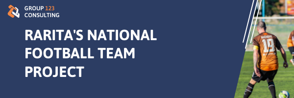

### Author: 
>
* Jia Xuan Muk
* Erica Soenarjo
* Viana Francisca Dewi
* Hiu Ming Yip
* Yolanda Li

## Executive Summary

In light of recent trends where “competitive” sport teams have benefited one’s economy considerably, this project is jointly executed with Rarita’s Commissioner of sport, Hammessi Bayes to construct a sustainable and “competitive” national team with a goal of achieving positive economic impact for Rarita. An initial fund of 995 million Doubloons (∂) were allocated for the project with additional capital raised through various revenue streams outlined within the report. 

This project employs empirical datasets of player statistics across 55 countries within leagues and tournaments held across 2020 to 2021 provided by the Society of Actuaries (SOA) for the national team selection and Brazilian FIFA along with GDP dataset to determine correlations between competitiveness and GDP growth. 

A final team selection was constructed via rigorous modelling involving logistic regression and best subset selection in considerations of qualitative measures such as salary, teamwork, and team formation. With a GDP growth of 2.32% and a revenue growth of 5.79% prior to winning a championship, the project is anticipated to project a supplemental 1.88% and 9.21% of growth respectively after winning the championship title, boosting Rarita’s economy significantly. Further, a high net present value (NPV) of ∂ 14,496.06 million computed from the 10-year net profit associated with the national team emphasizes the profitability and sustainability of the project. 

Finally, the construction of the national team is reinforced with a 10-year implementation plan detailing main events, mitigation strategies of main risks the projects may face and key metrics to monitor team performance.   

> For more details, please visit SOA website

## Objectives

With a goal to increase Rarita’s global visibility and achieve positive economic impact, Rarita has decided to construct a competitive and sustainable football squad amongst domestic players to enter the world of International Football. The soccer team’s “competitiveness” is further quantified and elaborated in Appendix A. With a limited budget of 995 million Doubloons, the project’s objective is to fulfill this goal through a comprehensive team selection process, a resilient risk mitigation framework, along with a detailed implementation plan and economic projections for the next 10 years incorporating a sensitivity analysis. 

## Team Selection
### Basic Formation
### Player Selection
### Alternative Formations
### Other Considerations

## Economic Impact  
### Revenue Projection

The total revenue for Rarita is projected to increase gradually across 2022 to 2031.

The winning prize is estimated using the 2022 FIFA winning prize, the hefty sum of winning the championship will significantly affect revenue growth during the championship year. Other revenue sources will also be impacted by the championship, resulting a sharp increase in total revenue during the championship year. The revenue growth remains relatively stable for all other years.	 
Additionally, by building a world class football stadium in 2022, supplemental revenue by renting out the venue can be generated. This revenue source is included in the commercial. 

<h1 align="center">
 
</h1>

### Expense Projection

The total expense includes two main categories, staff costs and other expenses. Of which, ∂99.86 million is attributed to the salary of football players.

The total expense for Rarita is expected to be higher in 2022 due to initial costs such as the stadium construction which costs approximately ∂520 million, developing team selection model, staff hiring, building training amenities and other facilities.

<h1 align="center">
 
</h1>

### Net Profit Projection

Rarita will experience loss for the first two years due to the large allocation to the stadium construction, however, will achieve a positive net profit for the remaining years. Despite the negative net profits, the initial investment of ∂ 995 million will act as a buffer to offset those losses. 
A positive net profit NPV demonstrates the sustainability and profitability of investing in a national football team.

<h1 align="center">
 
</h1>

### GDP Projection

Rarita’s GDP is estimated by referencing the data of a real-life national football team, Brazil National Football Team, a renowned "competitive" team holding titles to 5 Federation Internationale de Football Association (FIFA) championships since 1930. Winning a championship may have been a significant attribute for GDP growth as shown in the steadily increasing trend in Brazil's GDP for almost 10 years after its last FIFA championship in 2002. 

This observation underpins Rarita’s objectives. Therefore, the GDP growth rate for Brazil was used in projecting Rarita’s expected GDP. Incorporating the population growth, the GDP per Capita for Rarita will increase steadily and ended with ∂ 32,648 in 2031.

The figure below shows that the GDP per Capita for East Rarita would be the highest among the three provinces, while West Rarita would be the lowest. This can be accounted to the population differences in the three provinces.

<h1 align="center">
 
</h1>

### Macroeconomics

#### Tourism

A competitive football match may increase tourism as illustrated in the ‘Football Tourism in the UK’ report where 1.4 billion dollars were spent by overseas visitors who attended football matches across UK in 2019. The impact of a competitive football match not only adds revenue towards the commercial, broadcasting and matchday sectors for Rarita’s National Football Team, but it also generates indirect stream of revenues in via their consumptions. 

#### Employment Rate

Along with a booming tourism industry, huge number of employment opportunities are created through hospitality and travel services. Furthermore, this direct employment effect generates even more stream of revenues through secondary workforce demand to accommodate for the additional inflow of tourists. 
Correspondingly, this project would be beneficial to Rarita's microeconomic and macroeconomic sectors. The profit generated could be used to fund other social beneficial projects in the country. Furthermore, with an increased global visibility, the multiplier effect will also boost the impact of tourism and other economic sectors in the country with increased employment rate and tax revenues. 

## Implementation Plan

## Assumptions
### Key Assumptions
**Football Team**
>
* Performance not deviated from the past
* Teams not changed or improved in skill
* No home or away team advantages or disadvantages
* No loaning of players between nations during 2020 and 2021 tournaments 
* Winning probabilities from tournaments are tied to all individuals in the nation’s soccer teams 

**Championship year**
>
* Assumed that a win in 2025.
* Assumed to be a “competitive” team for the other years

### Quantitative Assumptions
**GDP Projection**
>
* GDP growth is calculated by using Brazil’s 1999–2008 national football team data as a benchmark where 2002 is the championship year.
* GDP growth rate: 2.32% before championship; 4.20% after championship
* Annual population growth for East Rarita is 0.67%; Central Rarita is 0.04%; and West Rarita is 0.57%

**Inflation Rate – 3.59%**

**Expense Projection**
>
* A constant growth rate of 4% for 2023-2031
* 0.88 Euro/USD conversion rate 
* 0.009 Doubloons/Euro conversion rate. 

## Risk and Risk Mitigation Strategies

## Data Limitations, Data Sources, and Sensitivity Analysis

## References

